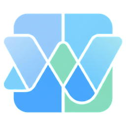

<div align="center">



# Desktop Widgets for Windows

**macOS-style desktop widgets for Windows 10 & 11.**
They live on your desktop behind your apps, just like on a Mac.

[](https://github.com/SreeAditya-Dev/Windows-Widgets/actions/workflows/ci.yml)
[](https://github.com/SreeAditya-Dev/Windows-Widgets/releases/latest)

[](#license)

</div>

---

## Features

- **Sits on the desktop, not over your work.** Widgets stay behind app windows and remain visible on Show Desktop (Win + D, taskbar corner, three-finger swipe).
- **Widget gallery** with live previews at every size, organised by category.
- **Edit Widgets mode**, like macOS: remove badges, resize handles, add and done buttons.
- **Smart Stack:** several widgets in one slot; scroll over it to flip between them.
- **Drag, snap and resize.** Widgets snap to a grid, move aside instead of overlapping, and resize to the sizes each widget supports.
- **Themes and styling:** Light, Dark or Auto; Glass, Solid or Colourful widget styles; opacity, corner radius and accent colour.
- **Lightweight setup:** one installer, optional start with Windows, no account, no API keys.

## Widgets

| Category | Widgets |
|---|---|
| Clocks | Analog Clock (S/M), Flip Clock (M/L), World Clock (M/L) |
| Productivity | Calendar (S/M/L), Notes (S/M/L), Reminders / To-do (S/M/L) |
| Utilities | Weather (S/M/L, [Open-Meteo](https://open-meteo.com), no API key), Timer (S/M), Stopwatch with laps (S/M), Calculator (L) |
| System | System Monitor with CPU, memory and disk rings (S/M/L), Batteries (S/M) |
| Photos | Photos from any folder (S/M/L/XL) |
| Featured | Smart Stack |

Sizes follow macOS: Small 170×170, Medium 360×170, Large 360×360, Extra Large 740×360.

## Install

1. Download `Desktop-Widgets-Setup-<version>.exe` from the [latest release](https://github.com/SreeAditya-Dev/Windows-Widgets/releases/latest).
2. Run the installer. It adds **Desktop Widgets** and **Widget Settings** to the Start menu and a desktop shortcut, then launches the app.
3. On first launch the app turns on **start with Windows**. You can switch this off in Settings → General.

> **SmartScreen warning:** builds are not code-signed yet, so Windows may show "Windows protected your PC". Choose **More info → Run anyway**.

## Usage

| Action | How |
|---|---|
| Move a widget | Drag it. It snaps to the grid on drop. |
| Resize | Drag the bottom-right corner, or right-click → pick a size. |
| Widget options | Right-click a widget: size, colour, edit, Smart Stack, lock, remove. |
| Edit Widgets mode | Tray menu, right-click menu, or the `+` button. |
| Add widgets | Open the gallery from Edit mode or the tray menu. |
| Settings | Tray → Settings…, or the **Widget Settings** Start menu entry. |

**Settings** follows the layout of macOS System Settings:

- **General:** launch at sign-in, keep widgets on Show Desktop, always on top, lock all widgets.
- **Appearance:** theme, widget style, opacity, corner radius, accent colour.
- **Desktop & Layout:** snap to grid, grid size, spacing, Arrange Widgets.
- **Widgets:** per-widget options such as time zones, weather city and units, photo folder, first day of the week, timer sound.

Settings are stored in `%APPDATA%\mac-widgets-windows\widgets-config.json`.

## How it works

The widget layer is a single transparent, click-through Electron window marked `WS_EX_TOOLWINDOW` (hidden from Alt+Tab and the taskbar) and `WS_EX_NOACTIVATE`. A guard in [`electron/win32.ts`](electron/win32.ts) polls the foreground window (via [koffi](https://koffi.dev) bindings to `user32`) and decides which layer the window belongs on:

| Foreground window | Widget layer |
|---|---|
| A normal app | `HWND_BOTTOM`, behind every app |
| The desktop (`WorkerW` / `Progman`) | `HWND_TOPMOST`, visible above the Show Desktop layer |
| A shell surface (context menu, tray flyout, taskbar) or the app's own tray menu | Unchanged, so widgets do not flicker or vanish |
| The widget layer itself (typing into a note) | Unchanged |

If the window is ever minimized or hidden, it is restored immediately. Rainmeter uses the same technique for its "On Desktop" position.

## Development

**Requirements:** Windows 10/11, [Node.js](https://nodejs.org) 22+.

```bash
git clone https://github.com/SreeAditya-Dev/Windows-Widgets.git
cd Windows-Widgets
npm install
```

| Command | Purpose |
|---|---|
| `npm run dev` | Hot-reload development |
| `npm run typecheck` | TypeScript type-check |
| `npm run build` | Type-check and build renderer + Electron code |
| `npm start` | Run the built app (`dist-electron/main.js`) without installing |
| `npm run dist` | Build and package the installer into `release/` |

`npm start` runs the **compiled** code, so run `npm run build` after changing anything under `electron/`.

### Project layout

```
electron/   Main process: window, tray, config store, Win32 desktop guard
src/        React renderer: widgets, gallery, settings, layout engine, Zustand store
build/      Installer resources (icon)
.github/    CI and release workflows
```

**Stack:** Electron, React 18, TypeScript, Vite, Tailwind CSS, Zustand, electron-builder.

## CI/CD and releases

- **Every push or pull request to `main`** runs the [CI workflow](.github/workflows/ci.yml): install, type-check, build, and package the installer. The installer is uploaded as a build artifact.
- **Pushing a version tag** (`v2.1.0`) runs the [Release workflow](.github/workflows/release.yml), which publishes the installer to GitHub Releases with generated notes.

See [RELEASING.md](RELEASING.md) for the versioning policy, release steps, smoke-test checklist and roadmap.

## Troubleshooting

- **Widgets vanish or sit on top of apps:** make sure you are running a current build (`npm run build` before `npm start`), and check Settings → General for *Always keep widgets on top*.
- **`spawn ... electron.exe ENOENT`:** antivirus removed the Electron binary. Exclude `node_modules\electron\dist` and run `node node_modules\electron\install.js`.

## License

MIT © SreeAditya
